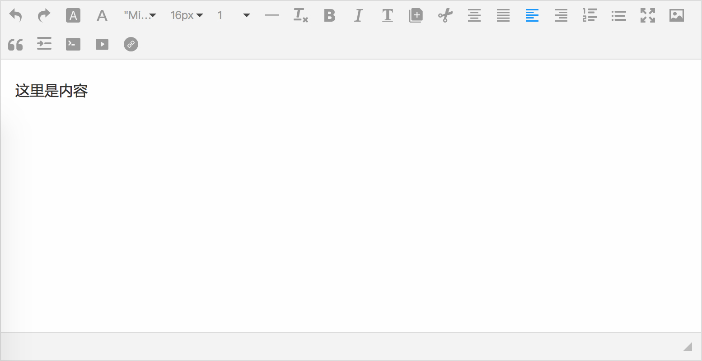

# ieditor

> IEditor 是 Web 端富文本编辑器。目前暂不支持 React 和 Angular 。[在线预览](http://output.jsbin.com/qiqibif)

[](https://www.npmjs.org/package/ieditor)
[](https://npmjs.org/package/ieditor)
[](https://npmjs.org/package/ieditor)
[](https://unpkg.com/ieditor)

[](https://saucelabs.com/u/_wmhilton)



[README in English](README.md)

## 功能

- 拖拽上传
- ajax 图片上传
- base64 图片显示
- 扩展 class 名
- 多语言支持
- 菜单分类
- 颜色可配置
- 样式自定义

## 相关链接

- 文档地址： [https://www.kancloud.cn/iq9891/ieditor/500799](https://www.kancloud.cn/iq9891/ieditor/500799)
- CDN
  - [unpkg](https://unpkg.com/ieditor)
  - [jsdelivr](https://cdn.jsdelivr.net/npm/ieditor@latest/dist/)
- [各版本下载 https://github.com/iq9891/ieditor/releases](https://github.com/iq9891/ieditor/releases)
- [更新记录](https://github.com/iq9891/ieditor/blob/master/changelog.md)

## 使用

- html 代码
```html
<!DOCTYPE html>
<html>
  <head>
    <meta charset="utf-8">
    <title>ieditor</title>
    <script src="https://unpkg.com/ieditor"></script>
  </head>
  <body>
    <div id="ied" class="ied"></div>
    <script>
    var myEditor = new window.IEditor('#ied')
    myEditor.create();
    </script>
  </body>
</html>
```

## 运行 demo
- 下载源码 `https://github.com/iq9891/IEditor.git`
- 安装或者升级最新版本 nodeJS（最低v9.x.x）
- 进入目录，安装依赖包 cd IEditor && yarn install
- 安装包完成之后，windows 用户运行 `npm run dev`，Mac 用户运行 `npm start` 。
- 打开浏览器 [http://localhost:8080/](http://localhost:8080/)
